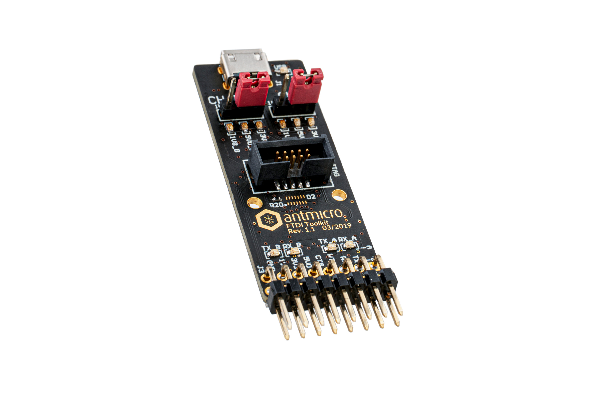

# FTDI Toolkit

Copyright (c) 2018-2023 [Antmicro](https://www.antmicro.com)

## Overview

This project contains open hardware design files for an experimental adapter board based on FTDI FT2232H/FT4232H IC.
The board exposes the programmable IO buses from the FT2232H/FT4232H on a 2.54 mm goldpin header, allowing the implementation of many popular IO interfaces which are useful during hardware debugging.
Those interfaces include:

* UART - two independent channels with optional flow control and selectable IO voltage (5.0V, 3.3V, 1.8V) 
* I2C bus master with selectable IO voltage standard (5.0V, 3.3V, 1.8V)
* SPI bus master with selectable IO voltage standard (5.0V, 3.3V, 1.8V)
* JTAG openocd-compliant with selectable IO voltage standard (5.0V, 3.3V, 1.8V) and fixed 3.3V IO voltage standard
* SWD openocd-compliant with selectable IO voltage standard (5.0V, 3.3V, 1.8V) and fixed 3.3V IO voltage standard

The design files were prepared in KiCad 6.x.

## Project structure

The main repository directory contains KiCad PCB project files, a LICENSE and README.
The remaining files are stored in the following directories:

* lib - contains the component libraries
* img - contains graphics for this README
* assets - contains visual assets for showcasing this project on [Open Hardware Portal](https://openhardware.antmicro.com)

## Licensing

This project is published under the [Apache-2.0](LICENSE) license.
